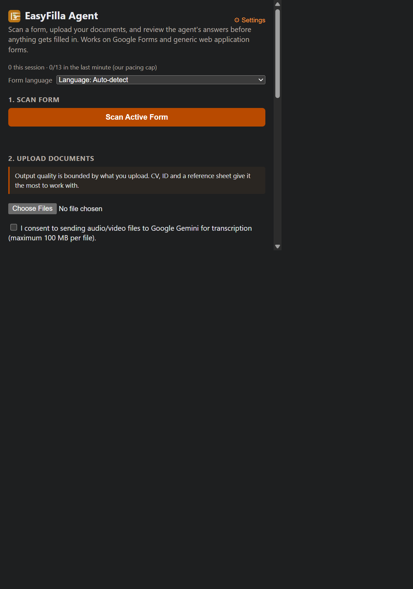

# EasyFilla

A Chrome extension (Manifest V3) that reads your documents and fills out forms
from them.

Scan a form → upload your files → export the questions as a PDF → generate
AI-drafted answers grounded in your own documents → review → fill.

You supply your own API key. Nothing is sent to any server operated by this
project.

## Side panel

---

## How it works

**Two stages.** Your uploaded files are read once into a structured *dossier* —
including scanned PDFs and photos, which the model reads natively, so no OCR is
required. Questions are then answered against that dossier rather than against
the raw files. The dossier is cached and only rebuilt when your files change.

**Provenance is derived, never assumed.** Every answer must cite the evidence it
came from. An answer with no supporting evidence is marked `needs_user_input`
rather than invented. Where two documents disagree, both are shown and neither
is selected. The report distinguishes:

- `answered_from_documents` — cites a real source file
- `ai_draft` — composed, needs your review
- `conflicting_sources` — two candidates, pick one
- `needs_user_input` — nothing in your files supports an answer
- `manual_only` — passwords, payment fields, CAPTCHAs, file uploads

**Review before you submit.** Answers are drafts. Read them.

---

## Install (development)

    npm install
    npm run build

Then in Chrome: `chrome://extensions` → enable Developer mode → *Load unpacked*
→ select the `dist/` folder.

Add your API key in the extension's Settings. Keys are stored in
`chrome.storage.local` and are never sent anywhere except the provider you
selected.

---

## Status

Working and tested in a live browser:

- Google Forms scanning, question export, and dossier-grounded answers
- Multi-section traversal
- Fill with per-field verification and a failure report naming what didn't fill

Implemented but **not yet verified against a live API**:

- Anthropic (Claude) as an alternative provider — no request has ever been made
- Gemini Files API path for uploads over ~18 MB
- Cross-origin iframe scanning on real application portals

Treat anything in the second list as unproven.

---

## Known limits

These are architectural, not bugs:

- **File-upload questions cannot be automated.** Google Forms attaches files
  through the Google Drive picker in a cross-origin frame. The extension names
  which of your documents matches the question; you attach it yourself.
- **Canvas- and PDF-rendered forms** have no DOM to read and are out of reach.
- **Ambiguous dates are refused rather than guessed.** `03/04/2001` with no
  stated format is left blank — a wrong date of birth is worse than an empty one.
- The extension **never auto-submits** a form.

---

## Privacy

Your uploaded documents — which may include ID photos, resumes, and academic
records — are transmitted to the AI provider you select. See
[privacy-policy.md](privacy-policy.md) for what is stored, where, and for how
long.

Free-tier API keys may have their content used for product improvement and human
review, depending on the provider. If you are uploading identity documents,
read your provider's current terms first.

`chrome.storage.local` is unencrypted on disk. Anyone with access to your Chrome
profile can read your API key and your extracted profile data.

---

## Development

    node tests/run.mjs      # browser-free test suite
    npx tsc --noEmit
    npm run build

Two sha-pinned golden files freeze the exact request bodies sent to the AI
provider — one at the transport layer, one at the orchestration layer. If a
change alters a request, the suite fails. **Fix the code, not the golden.** See
`HANDOFF.md` for the invariants that must not be relaxed.

---

## License

MIT — see [LICENSE](LICENSE).
